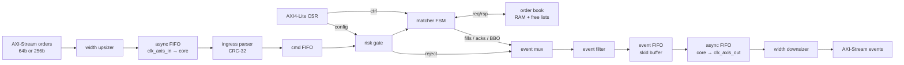
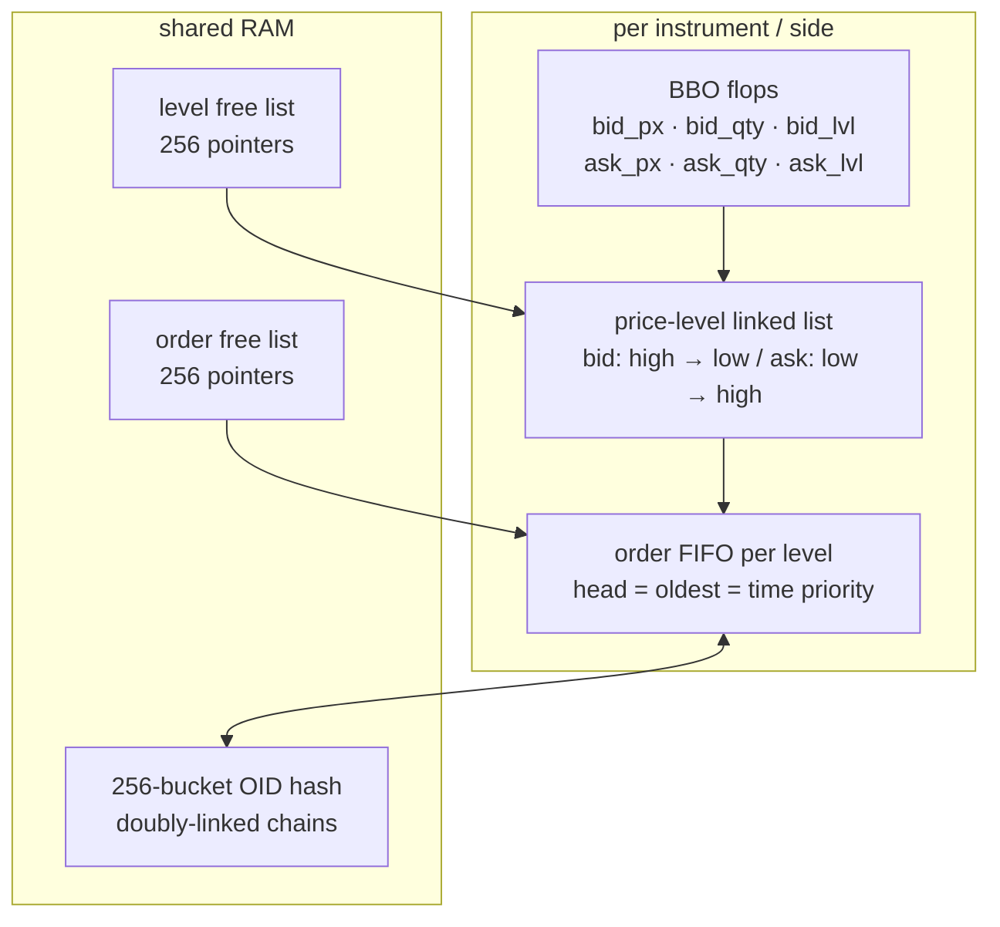
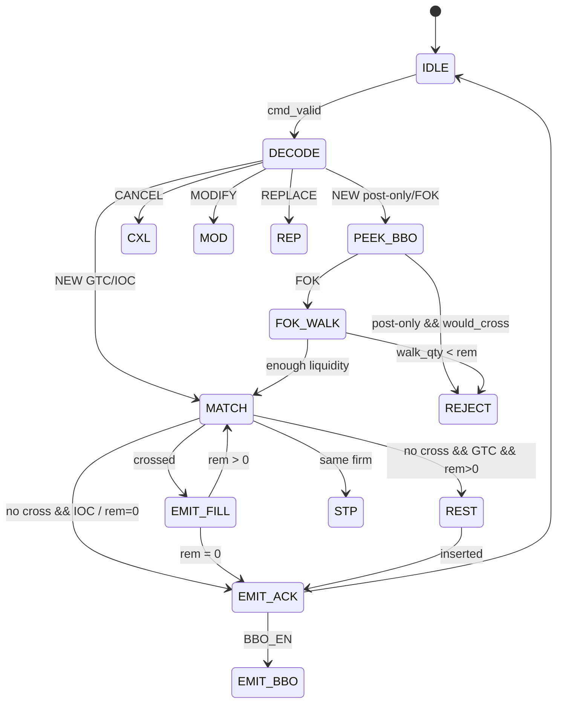

# Quasar

A synthesizable limit-order-book matching engine written in SystemVerilog.
Named after a bright point source.

- [quasar](https://github.com/Aneesh495/quasar) — synthesizable SystemVerilog limit-order-book matching engine (this repo)
- [planck](https://github.com/Aneesh495/planck) — cycle-accurate out-of-order RV32IM core, cache hierarchy, and assembler in pure x86-64 assembly

The interesting problem here is not the trading logic — price-time priority
is a sorted list and a FIFO.  The interesting problem is doing it in silicon:
pointers in BRAM, one-cycle BBO reads, O(1) cancel from a hash table, CDC
between clock domains, and verification that survives synthesis.

---

## What it does

Takes 256-bit binary order messages on an AXI4-Stream input, runs them through
a CRC check, a configurable risk gate, and a RAM-backed price-time-priority book
for up to eight simultaneous names.  Emits fill/ack/reject/BBO events on a
second AXI-Stream.  Configuration (max notional, position cap, rate bucket,
instrument mask) lives behind an AXI4-Lite register bank.

A 64-bit narrow-pin option reassembles four-beat frames so the block can sit
behind a standard AXI-Stream fabric without a separate width-convert layer.

---

## Architecture



**`quasar_core`** is the single-clock engine.
**`quasar_soc`** wraps it with per-domain reset synchronizers and two
gray-coded async FIFOs.  Smoke simulation ties all clocks together; the
CDC hardware elaborates and can be reviewed or formally constrained.

Deeper block descriptions and diagrams: [`docs/architecture.md`](docs/architecture.md).

---

## Book data structures



- **BBO** is a registered snapshot so `PEEK_BBO` is one cycle, no RAM read.
- **Levels** are a doubly-linked sorted list; insertion walks from best to find the slot.
- **Orders** at a level enforce time priority: dequeue from head, enqueue at tail.
- **OID hash** (xor-fold, 256 buckets) with doubly-linked collision chains:
  cancel and fill-to-zero are O(1) pointer unlinks after the bucket walk.

---

## Matching pipeline



One command in-flight at a time.  `MATCH_ONE` is re-issued while the residual
still crosses the opposite BBO.  Each fill is pushed through the event FIFO
*before* the next book command, so a stalled consumer cannot lose a trade even
if it holds `TREADY` low indefinitely.

---

## Clock domains

| Domain | Clock | Contents |
|--------|-------|---------|
| Ingress fabric | `clk_axis_in` | upsizer, async FIFO write |
| Core | `clk_core` | parser, risk, matcher, book, CSR, event FIFO |
| Egress fabric | `clk_axis_out` | async FIFO read, downsizer |
| Control | `clk_axil` | AXI4-Lite pins (shares `clk_core` in this wrapper) |

CDC: gray-coded binary pointers, two-flop synchronizers.  One bit changes per
pointer increment, so metastability on any single flip-flop cannot produce
a pointer jump of more than one.

---

## Design notes

**O(1) cancel.** Every order carries `hash_prev/hash_next` (collision chain)
and `prev_ord/next_ord` (level queue).  Cancel by OID is a hash probe then
four pointer splices.  No queue scan.

**FOK is non-destructive on failure.** `BOOK_WALK_LIQ` accumulates crossing
quantity without unlinking anything.  Reject on short liquidity, book untouched.

**Replace semantics.** Same price → in-place qty modify (keeps time priority).
Different price → atomic cancel + new with the same OID.  The book never sees
two live orders with the same OID.

**STP at book time.** Checked when `MATCH_ONE` returns the resting firm.  The
risk gate cannot know what is resting at any price; only the book can.

**Valid/ready everywhere.** Skid buffers cut combinational ready paths at every
inter-block hop.  The event log uses drop-on-full with a saturating counter —
it degrades gracefully under backpressure rather than stalling the book.

---

## Quickstart

```bash
# Prerequisites: Verilator >= 5.020, g++ C++17, make
sudo apt-get install -y verilator g++ make

make all        # all directed tests

# Individual targets:
make fifo       # sync/async FIFO, CRC-32, priority encoder
make book       # book command unit test
make risk       # risk gate rejection codes
make book_stress  # near-full, 16-order queue, multi-instrument
make axil       # AXI-Lite R/W, byte strobes, soft-reset
make scenarios  # multi-level fill, FOK, IOC, dup, mask, disabled
make smoke      # quasar_core end-to-end
make regression # cascading fills, STP, replace, BBO, rapid-fire
make advanced   # interleaved 8-instrument, position limit, soft-reset

# Standalone C++ golden model:
g++ -std=c++17 -O2 -Imodel model/golden_book.cpp model/quasar_sim.cpp \
    -o quasar_sim && ./quasar_sim
```

Full UVM with covergroups needs a commercial simulator (Xcelium, VCS, Questa).
The UVM-lite classes in `tb/uvm_lite/` map 1:1 to UVM agents and use the same
C++ DPI scoreboard.

---

## Repository layout

```
rtl/
  pkg/          quasar_pkg.sv — types, opcodes, structs, CSR map
  infra/        FIFO, CDC, skid, CRC, free-list, counter, AXIS/AXI-Lite
  book/         order book FSM + BBO-depth scanner satellite
  match/        matching pipeline FSM + per-session order tracker
  risk/         risk gate
  ingress/      AXIS parser + multi-session arbiter
  egress/       event FIFO + per-type event filter
  csr/          AXI4-Lite + saturating perf counters
  soc/          quasar_core, quasar_soc, pipeline watchdog

tb/
  smoke/        Verilator directed tests
  uvm_lite/     driver / monitor / scoreboard / sequences
  common/       CRC helper, txn class

assert/         SVA properties, covergroups, bind file
model/          C++ and SV golden books, standalone test driver
docs/           architecture, protocol, verification, CSR map
scripts/        filelist.f
```

---

## What is working

- NEW / CANCEL / REPLACE / MODIFY / STATUS opcodes
- Partial fills, multi-level price-walk, FOK/IOC/GTC, post-only
- STP: cancel-resting, cancel-taker, cancel-both
- Hash-collision-correct cancel and book-full detection
- Risk: max notional, max |position|, token-bucket rate
- AXI4-Lite CSR: all registers, byte strobes, self-clearing soft reset
- Gray-coded async FIFOs (CDC path elaborates and is formally constrainable)
- All directed tests pass under Verilator

Not claimed: closed timing report, production venue gateware drop, full UVM-1.2.

Protocol: [`docs/protocol.md`](docs/protocol.md) —
CSR map: [`docs/csr_map.md`](docs/csr_map.md)

---

MIT — [`LICENSE`](LICENSE)
