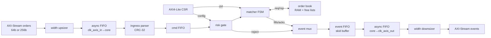
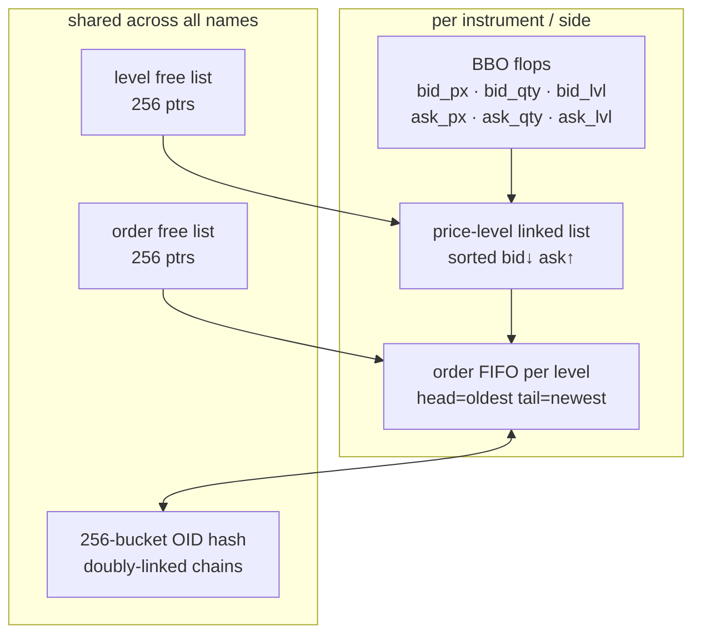
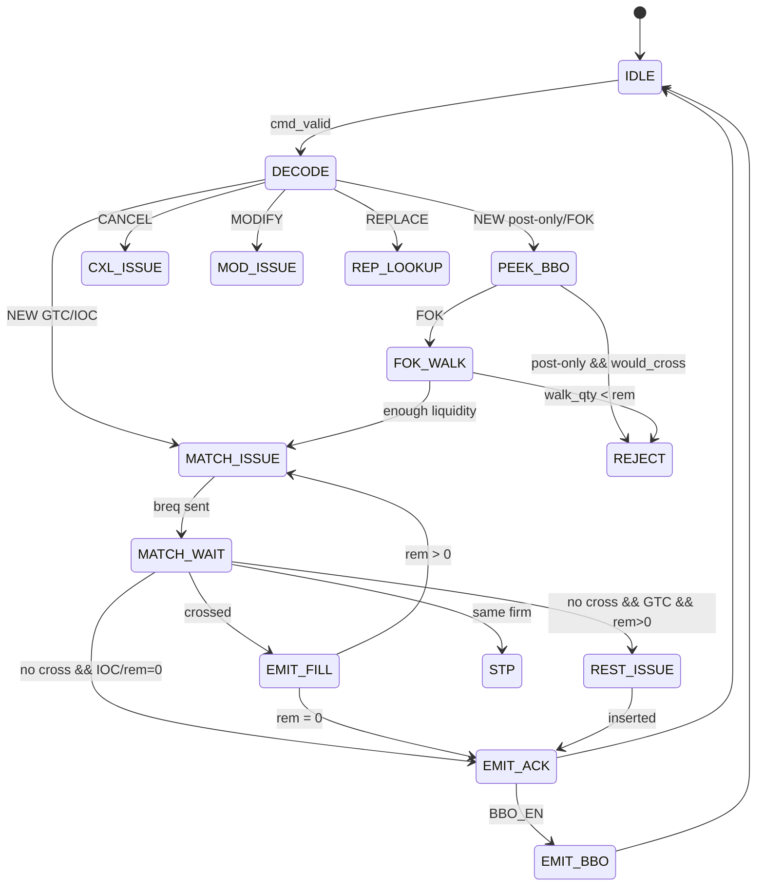

# Quasar

A synthesizable limit-order-book matching engine written in SystemVerilog.
Named after a bright point source — the matching core is small and very fast.

The interesting problem here is not the trading logic (price-time priority is
just a sorted list and a FIFO).  The interesting problem is *doing it in silicon*:
pointers in BRAM, one-cycle BBO reads, O(1) cancel from a hash table, CDC between
clocks that the FPGA vendor drew on different parts of the die, and building the
verification so you can be confident the matching semantics survive synthesis.

This is a personal project; the code is the spec.

---

## What it does

Takes 256-bit binary order messages on an AXI4-Stream input, runs them through
a CRC check, a configurable risk gate, and a RAM-backed price-time-priority book
for up to eight simultaneous names.  Emits fill/ack/reject events on a second
AXI-Stream.  Configuration (max notional, position cap, rate bucket, instrument
mask) lives behind an AXI4-Lite register bank that a host CPU or state machine
can write at startup or mid-session.

The 64-bit narrow-pin option reassembles four-beat frames so the block can sit
behind a standard 64-bit AXI-Stream fabric.

---

## Architecture



**`quasar_core`** is the single-clock engine (ingress through egress).
**`quasar_soc`** wraps it with per-domain reset synchronizers and the two
async FIFOs.  Smoke simulation ties all clocks together; the CDC hardware
is still elaborated and can be reviewed or formally constrained.

---

## Book data structures



- **BBO** is a registered snapshot per instrument so a `PEEK_BBO` is one
  clock with no RAM read.
- **Price levels** are a doubly-linked sorted list; insertion walks from best
  to find the slot.
- **Order FIFO** at each level enforces time priority: dequeue from head, enqueue
  at tail.
- **OID hash** (xor-fold, 256 buckets) with doubly-linked collision chains means
  cancel and fill-to-zero are O(1) pointer unlinks after the bucket walk.

---

## Matching pipeline



One command is in-flight at a time.  `MATCH_ONE` is re-issued while residual
quantity still crosses.  Each fill is pushed through the event FIFO *before*
the next book command, so a stalled consumer never loses a trade even if it
holds `tready` low.

---

## Pipeline latency (clk_core cycles)

These are deterministic FSM depths, not place-and-route numbers.
Target: 250–400 MHz on VU9P/VU19P class BRAMs.

| Path | Cycles |
|------|--------|
| NEW that rests on empty book | ~13 |
| NEW partial fill (one resting order) | ~15–18 |
| NEW full fill + level removal | ~20–28 |
| Cancel by oid (no hash pile-up) | ~16–22 |
| FOK reject (walk then refuse) | 2 × levels + overhead |

At 250 MHz: **~50–90 ns** on the common path.  The book is a general-price
linked structure so "bitmap BBO" tricks are not assumed; `quasar_prio_encoder`
is in-tree for a discretized-tick follow-on.

---

## Clock domains

| Domain | Clock | Contents |
|--------|-------|---------|
| Ingress fabric | `clk_axis_in` | upsizer, async FIFO write side |
| Core | `clk_core` | parser, risk, matcher, book, CSR, event FIFO |
| Egress fabric | `clk_axis_out` | async FIFO read, downsizer |
| Control | `clk_axil` | AXI4-Lite pins |

Crossing uses gray-coded binary pointers (extra-wide, MSB-flip = one change per
step), two-flop synchronizers.  XDC/SDC constraint: `set_max_delay –datapath_only`
on the gray buses.  An independent `clk_axil` would need a fourth async path; in
this wrapper it shares `clk_core` — documented in `docs/architecture.md`.

---

## Design notes

**O(1) cancel.**  Every order record carries `hash_prev/hash_next` (collision
chain) and `prev_ord/next_ord` (level queue).  Cancel by OID does a hash bucket
walk, then four pointer splices.  No level or queue scan.

**FOK is non-destructive on failure.**  `BOOK_WALK_LIQ` accumulates crossing
quantity without unlinking anything.  If the total is short, the command is
rejected and the book is untouched.

**Replace semantics.**  Same price → in-place qty modify (keeps time priority).
Different price → atomic cancel + new with the same OID.  The book never sees
two live orders with the same OID.

**STP at book time.**  Self-trade protection is checked when `MATCH_ONE` returns
the resting firm, not when the order arrives.  The risk gate cannot know what is
resting; only the book can.

**Risk gate is one registered cycle.**  Max-notional, max-|position|, token bucket.
Rejects go through the same egress path as matcher rejects so the downstream
consumer never sees a gap in the event stream.

**Valid/ready everywhere.**  Skid buffers cut combinational ready paths at every
inter-block hop.  The event log uses a drop-on-full FIFO with a saturating counter
— it degrades gracefully under backpressure rather than stalling the book.

---

## Quickstart

```bash
# Prerequisites: Verilator >= 5.020, g++ C++17, make
sudo apt-get install -y verilator g++ make

make all        # 8 directed tests
make fifo       # sync/async FIFO, CRC-32, priority encoder
make book       # book command unit test
make risk       # risk gate rejection codes
make book_stress  # near-full, 16-order queue, multi-instrument
make axil       # AXI-Lite R/W, byte strobes, soft-reset
make scenarios  # multi-level fill, FOK, IOC, dup, mask, disabled
make smoke      # quasar_core end-to-end
make regression # cascading fills, STP, replace, BBO, rapid-fire
make loc        # line counts

# Standalone C++ golden model (no Verilator needed):
g++ -std=c++17 -O2 -Imodel model/golden_book.cpp model/quasar_sim.cpp \
    -o quasar_sim && ./quasar_sim
```

Full UVM with covergroups and a commercial UVM agent needs a commercial
simulator (Xcelium, VCS, Questa).  The UVM-lite classes in `tb/uvm_lite/`
map 1:1 to UVM agents.

---

## Repository layout

```
rtl/
  pkg/          quasar_pkg.sv — types, opcodes, structs, CSR map
  infra/        FIFO, CDC, skid, CRC, free-list, counter, AXIS/AXI-Lite
  book/         order book FSM + BBO-scan satellite
  match/        matching pipeline FSM
  risk/         risk gate
  ingress/      AXIS slave + CRC + parser
  egress/       event FIFO + AXIS master
  csr/          AXI4-Lite + saturating perf counters
  soc/          quasar_core, quasar_soc, watchdog

tb/
  smoke/        Verilator directed tests (8 total)
  uvm_lite/     driver / monitor / scoreboard / sequences
  common/       CRC helper, txn class

assert/         SVA properties, covergroups, bind file
model/          C++ and SV golden books, standalone sim driver
docs/           architecture, protocol, verification, CSR map
scripts/        loc.sh, filelist.f
```

---

## LOC

Run `make loc`.  Current figure: **~8,900 sv/svh lines** (RTL + TB + SVA + SV model).

| Subsystem | Lines | Notes |
|-----------|-------|-------|
| `rtl/pkg` + `rtl/infra` | ~1,500 | types and shared primitives |
| `rtl/book` + `rtl/match` | ~2,200 | the core matching logic |
| `rtl/risk` + rest of `rtl/` | ~1,200 | SoC plumbing |
| `tb/` (smoke + uvm_lite) | ~2,800 | directed, random, golden scoreboard |
| `assert/` + `model/*.svh` | ~750 | SVA, covergroups, SV golden |

C++ golden model (`model/*.cpp/hpp`) is another ~750 lines, standalone.

---

## What is working

- NEW / CANCEL / REPLACE / MODIFY / STATUS / MASS_CXL opcodes
- Partial fills, multi-level price-walk, FOK/IOC/GTC/DAY, post-only
- STP (cancel-resting, cancel-taker, cancel-both)
- Hash-collision-correct cancel and book-full detection
- Risk: max notional, max |position|, token-bucket rate
- AXI4-Lite CSR: all registers, byte strobes, self-clearing soft reset
- Gray-coded async FIFOs (CDC path elaborated and compiled)
- 8 Verilator tests: all pass

Not claimed: closed timing report, production venue drop, full UVM-1.2 in this tree.

---

MIT — [`LICENSE`](LICENSE)
