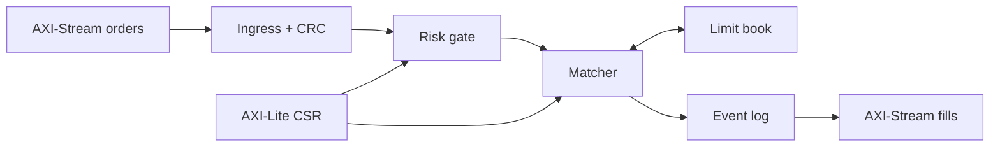

# Quasar

**Synthesizable limit-order-book matching engine** in SystemVerilog.
Built for FPGA/ASIC interviewers and for the kind of latency-path review
a cash-equities or futures desk actually does: price-time priority,
partial fills, cancel/replace correctness, risk in front of the book,
and an AXI-Stream / AXI-Lite SoC wrapper — not a behavioural toy.

Quasar is the repo name and the top (`quasar_soc` / `quasar_core`).
MIT licensed.

## Why this exists

Matching is the inner loop of every electronic venue and of every
aggressive HFT stack that *internalizes* or *simulates* a venue.  On
FPGA it is a data-structure problem (pointer chasing in BRAM) plus a
protocol problem (lossy links, backpressure, CRC) plus a risk problem
(a bad order must die before it touches the book).  Quasar is that
path, written so a hardware engineer can read the FSM and a trading
engineer can read the semantics and they agree.

Target: 250–400 MHz class close on a VU9P / VU19P / Agilex book-shaped
SRAM map.  The RTL does not pretend it has been through P&R; it *does*
pretend it could be.

## Architecture



| Block | What it does |
|-------|----------------|
| **Ingress** | AXI4-Stream slave, 256-bit native / 64-bit 4-beat adapter, CRC-32, opcode decode |
| **Book** | 8 instruments, price-sorted levels, FIFO order queues, hashed OID, BBO flops |
| **Matcher** | decode → risk → lookup → match\* → rest → emit; GTC/IOC/FOK/post-only; STP |
| **Risk** | max notional, max \|position\|, token-bucket rate, CSR-configurable |
| **Egress** | fills / rejects / acks / BBO, FWFT event FIFO, drop counters |
| **SoC** | AXI4-Lite CSR + counters, reset sync, gray-coded async FIFOs |

Deeper diagrams (book RAMs, pipeline states, clock domains):
[`docs/architecture.md`](docs/architecture.md).

Wire formats and matching rules: [`docs/protocol.md`](docs/protocol.md).

CSR map: [`docs/csr_map.md`](docs/csr_map.md).

## Pipeline / latency

One command in-flight.  Each `MATCH_ONE` is a multi-cycle book
transaction; each fill is emitted **before** the next hop so a stalled
consumer cannot lose a trade.

| Path | Typical `clk_core` cycles |
|------|---------------------------|
| NEW that rests on an empty book | ~13 |
| NEW that partially fills one resting order | ~15–18 |
| Cancel by oid (no hash pile-up) | ~16–22 |
| FOK reject (walk then refuse) | 2 × crossing levels + overhead |

At 250 MHz that is a **~50–90 ns** decision on the common path, in the
same conversation as a well-built FPGA tick-to-trade *minus* MAC/PCS.
The book is a general-price linked structure, not a 1-cycle bitmap;
`quasar_prio_encoder` is in-tree for the discretized-tick sequel.

## Design highlights

* **Price-time priority** with maker pricing.  Levels are a sorted
  linked list; orders at a price are a doubly-linked FIFO.
* **O(1) cancel** after the hash probe: orders carry `hash_prev/next`
  and `prev_ord/next_ord`.
* **FOK is two-pass** (`WALK_LIQ` then commit) so a failed FOK never
  mutates the book.
* **Replace** is modify-in-place when the price is unchanged, else
  atomic cancel + new with the same oid.
* **STP** is decided against the resting firm, not guessed in the risk
  gate.
* **Valid/ready everywhere.**  Skid buffers cut ready timing; the
  event log drops only if the consumer ignores `tready` past depth 64.
* **Solid AXI4-Lite** (independent channels, strobes, self-clearing
  soft reset) instead of a decorative CPU.
* **Documented dual-clock SoC** even though smoke ties the clocks.

## Quickstart

```bash
# Verilator >= 5.020
sudo apt-get install -y verilator g++ make   # or brew / module load

make fifo    # infra
make book    # book unit test
make smoke   # quasar_core directed stream   <-- start here
make uvm     # UVM-lite + C++ golden scoreboard
make all
make loc
```

`make smoke` drives 256-bit AXIS into `quasar_core`, checks fills /
cancels / replace / CRC reject / AXI-Lite `VERSION`, and exits 0 on
success.  Full procedure and coverage goals:
[`docs/verification.md`](docs/verification.md).

Commercial simulators are required for SystemVerilog covergroups and a
textbook UVM agent.  The UVM-lite classes in `tb/uvm_lite/` are the
same transactions; wrap them.

## Repository layout

```
rtl/pkg          quasar_pkg.sv — opcodes, packed msgs, helpers
rtl/infra        FIFO, async FIFO, skid, CRC, AXIS/AXI-Lite, free list
rtl/book         RAM-backed limit book
rtl/match        matching pipeline
rtl/risk         notional / position / rate / STP hook
rtl/ingress      AXIS slave + parser FSM
rtl/egress       event log + AXIS master
rtl/csr          AXI-Lite + saturating counters
rtl/soc          quasar_core, quasar_soc
tb/smoke         Verilator directed tests
tb/uvm_lite      driver / monitor / scoreboard / sequences
tb/common        CRC + txn package
assert           SVA + covergroups
model            C++ / SV golden books + DPI
docs             architecture, protocol, verification, CSR
scripts          loc.sh, filelist.f
```

## LOC map

Run `make loc` for the live count.  The project is sized as a
**~10k-line** RTL+TB+SVA SystemVerilog tree (not padded).  Rough
split:

| Tree | Role |
|------|------|
| `rtl/pkg` + `rtl/infra` | types and reusable silicon |
| `rtl/book` + `rtl/match` | the thing interviewers actually read |
| `rtl/risk` + `rtl/{ingress,egress,csr,soc}` | production-shaped SoC |
| `tb/` + `assert/` + `model/*.svh` | directed, random, SVA, golden |

C++ in `model/` is extra and does not count toward that figure.

## What is real

Working, testable RTL for new / cancel / replace / modify, partial
fills, FOK/IOC/GTC, post-only, STP, risk CSRs, AXI-Stream, AXI-Lite,
and dual-clock FIFOs.  The book unit test hits time priority, price
priority, mid-queue cancel, and hash collisions.

Not claimed: a closed timing report, a production venue gateware
drop, or a full UVM-1.2 environment in this tree.

## License

MIT — see [`LICENSE`](LICENSE).
