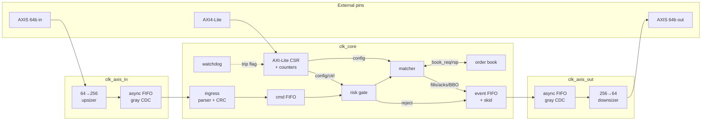
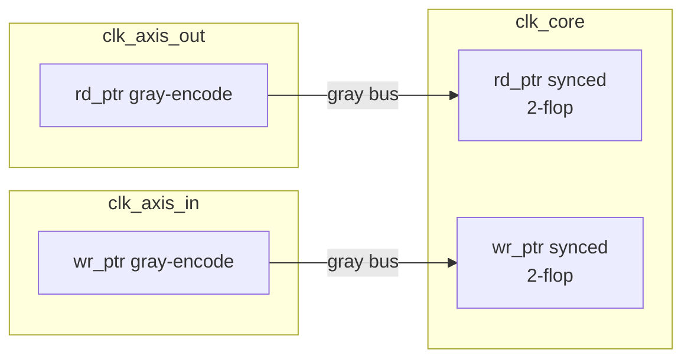

# Architecture

## Overview

Quasar is a single-pipeline matching engine with a RAM-backed multi-instrument
limit book.  The block diagram below shows the production-intent topology;
smoke simulation ties all clock pins together, so the CDC hardware elaborates
but runs degenerate.



`quasar_core` is the single-clock engine.  `quasar_soc` wraps it with
per-domain reset synchronizers and the two async FIFOs; it also instantiates
the 64b↔256b width converters on both the ingress and egress paths.

---

## Block descriptions

### Ingress (`rtl/ingress/quasar_ingress.sv`)

Four-state FSM: IDLE → CRC → DECODE → PUSH.

A 256-bit beat arrives on `clk_axis_in` (or four 64-bit beats after upsizing).
The CRC-32 (IEEE, poly 0xEDB88320) is computed combinationally over bytes 0–27
and compared with bytes 28–31 of the beat.  A mismatch sets `crc_ok=0` on the
decoded `cmd_t`; the risk gate then emits `REJ_CRC` without touching the book.

Framing errors from the upsizer (early or missing TLAST) synthesise a synthetic
reject command so the downstream sees a well-formed `EV_REJECT` rather than
a silent hole in the stream.

### Risk gate (`rtl/risk/quasar_risk_gate.sv`)

One registered decision cycle.  Evaluation order:

1. Engine-enable flag
2. CRC flag from parser
3. Opcode / instrument / mask
4. `qty == 0` on NEW (zero qty not meaningful)
5. `price == 0` on NEW / REPLACE
6. Max notional (`qty * price`, 64-bit, disabled when 0)
7. Hypothetical signed position after a full fill (disabled when 0)
8. Token-bucket rate limit (disabled when limit == 0)

STP mode injection: if `CTRL.STP_EN` and the message left `stp == OFF`, the gate
stamps the configured `STP_MODE` onto the command before passing it forward.
The actual STP decision (whether resting and taker share a firm) is made in the
book on `MATCH_ONE`.

A reject raises `hold_rej` for one cycle.  The event mux in `quasar_core`
captures it into a registered event word and routes it to egress, bypassing
the matcher.

### Order book (`rtl/book/quasar_book.sv`)

Shared SRAM-backed book for all instruments.  Single read port + single write
port per memory (order RAM, level RAM, hash RAM) so synthesis can infer block
RAMs.

**Command interface**: `book_req_t` / `book_rsp_t`, valid/ready.  Commands:

| Command | What it does |
|---------|-------------|
| `PEEK_BBO` | One cycle; reads BBO flops |
| `LOOKUP_OID` | Hash walk; returns price/qty/side |
| `MATCH_ONE` | Dequeue head of opposite best level, partial or full fill |
| `INSERT` | Hash check, level walk/create, enqueue at tail |
| `CANCEL` | Hash walk, doubly-linked unlink of order + maybe level |
| `MODIFY` | In-place qty update; level agg_qty tracks |
| `WALK_LIQ` | Non-destructive accumulation across crossing levels (FOK probe) |
| `UNLINK_RESTING` | Cancel BBO head without changing aggressor qty (STP) |
| `GET_STATUS` | Returns BBO fields |

After reset the book spends 256 cycles zeroing the 256-bucket hash table
(`ST_INIT`).  The matcher simply waits on `req_ready`.

**BBO latency note:**  The BBO registers (bid_px, ask_px, ...) are updated in
the same `always_comb` + `always_ff` cycle that the last order of a level is
removed.  The `CANCEL` response and `MATCH_ONE` response capture the BBO flops
*before* the update is committed (the response is built from `bbo`, not
`bbo_n`).  A subsequent `PEEK_BBO` command from IDLE correctly sees the updated
value.  This is a one-cycle stale-flag read on the terminal event; structural
invariants (`orders_used`, `levels_used`) are always correct.

### Matcher (`rtl/match/quasar_matcher.sv`)

Orchestrates the book by issuing sequences of book commands in response to a
single ingress command.  The full state diagram is in `README.md`.  Key
sequencing rules:

- Each `MATCH_ONE` is followed by an `EMIT_FILL` *before* the next book
  command.  This means a stalled egress cannot cause a fill to be lost,
  the book does not advance until the fill has been accepted by the event FIFO.
- Residual after IOC is discarded (no INSERT).
- FOK first issues `WALK_LIQ`; only if `walk_qty >= rem` does it proceed to
  match.  A failed FOK never issues `MATCH_ONE`.
- Replace: a `LOOKUP_OID` first determines whether the price changed.  Same
  price → `MODIFY`.  Different price → `CANCEL` then re-enter as NEW with the
  same OID.

### Egress (`rtl/egress/quasar_egress.sv`)

FWFT sync FIFO (depth 64, drop-on-full with counter) then a skid buffer that
presents AXI-Stream master.  The egress never stalls the matcher, it either
accepts or drops, and the `DROP_EGRESS` CSR counter increments.  Normal
operation never reaches drop depth because the matcher throttles naturally
(one command in-flight).

---

## Clock domains and CDC



`quasar_gray_cdc` gray-encodes the binary pointer on the source clock, then
double-flops it on the destination clock and decodes back to binary.  Safety
property: because the binary counter is gray-coded, only one bit changes per
increment, so a metastability event on any single bit cannot produce a pointer
value that jumps by more than one.

Timing constraints (synthesize with):
```
set_max_delay -datapath_only -from [get_cells *gray_cdc*/src_gray*] \
    -to [get_cells *gray_cdc*/dst_gray_m*] <period>
```

The AXI4-Lite path: in this wrapper, `clk_axil` is connected to `clk_core`.
A production integration with a separate PCLK would add a third async FIFO
or a simple clock-domain-crossing register file for the slow CSR path.

---

## Reset

`quasar_rst_sync`, three-stage async-assert / synchronous-deassert per domain.
The external `rst_n` feeds all four instances; each domain deasserts its local
`rst_n` on its own clock edge, avoiding the metastability that a direct async
reset crossing would introduce.

Soft reset (`CTRL[1]`, self-clearing): resets matcher state, risk counters, and
token bucket.  The book SRAMs are *not* scrubbed, a full `rst_n` or issuing
`MASS_CXL` on every instrument name is needed for a clean book.

---

## Module hierarchy

```
quasar_soc
├── quasar_rst_sync ×4
├── quasar_axis_upsizer
├── quasar_async_fifo  (ingress CDC)
├── quasar_core
│   ├── quasar_ingress
│   │   └── quasar_crc32_comb
│   ├── quasar_sync_fifo  (cmd FIFO)
│   ├── quasar_risk_gate
│   ├── quasar_matcher
│   ├── quasar_book
│   │   ├── quasar_free_list ×2
│   │   └── (inline SRAMs: ord_mem, lvl_mem, hash_mem)
│   ├── quasar_egress
│   │   ├── quasar_sync_fifo  (event log)
│   │   └── quasar_skid_buffer
│   ├── quasar_csr
│   └── quasar_perf_counters
│       └── quasar_counter ×8
└── quasar_async_fifo  (egress CDC)
└── quasar_axis_downsizer
```

Satellite modules (not in the main datapath):
- `quasar_bbo_scan`, walks level chains on demand for depth snapshots
- `quasar_watchdog`, detects stuck pipelines; raises a CSR flag

---

## Capacity parameters

All in `rtl/pkg/quasar_pkg.sv`.

| Parameter | Default | Notes |
|-----------|---------|-------|
| `NUM_INSTRUMENTS` | 8 | CSR mask can disable names |
| `MAX_ORDERS` | 256 | one BRAM slice |
| `MAX_LEVELS` | 256 | shared across all names |
| `HASH_BUCKETS` | 256 | 8-bit xor-fold OID hash |
| `PRICE_W` / `QTY_W` | 32 / 32 | integer ticks / lots |
| `OID_W` | 64 | client-allocated unique id |
| `FIFO_DEPTH_INGRESS` | 16 | cmd FIFO |
| `FIFO_DEPTH_EGRESS` | 64 | event log |
| `FIFO_DEPTH_CDC` | 16 | each async FIFO |

Changing `MAX_ORDERS` to 1024 and `MAX_LEVELS` to 512 requires adjusting
`PTR_W` to 11 and regenerating the free-list init loops, everything else
scales automatically from the package.
