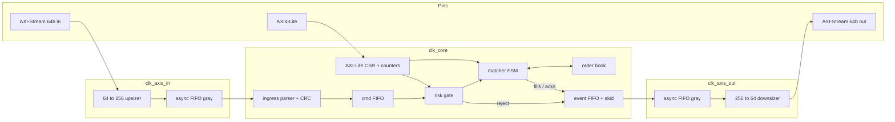
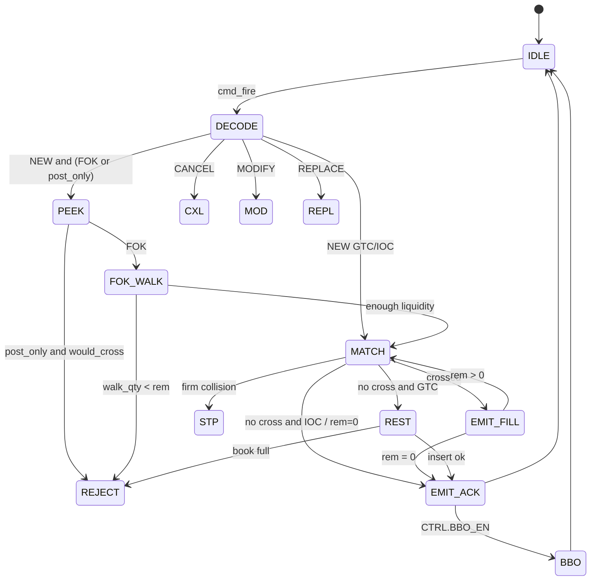
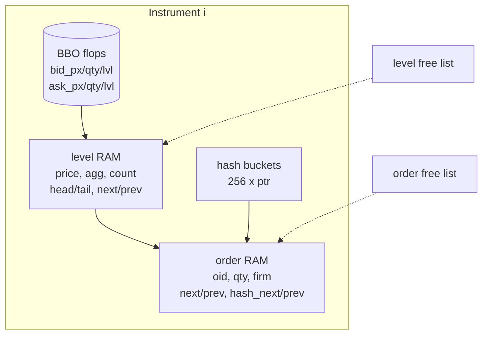

# Quasar architecture

Quasar is a **single-pipeline matching engine** with a RAM-backed
multi-instrument limit book.  It is written to be synthesizable: every
mutating book operation is a multi-cycle FSM that issues at most one write
per SRAM per cycle, and every hop between units is `valid`/`ready`.

## Block diagram



`quasar_core` is the single-clock engine.  `quasar_soc` wraps it with
per-domain reset synchronizers and the two async FIFOs.  Smoke simulation
ties `clk_axis_in = clk_core = clk_axis_out = clk_axil`; the CDC modules
are still elaborated so the gray-code path can be reviewed and
constrained.

## Clock domains

| Domain         | Clock           | Contents                                      | Reset            |
|----------------|-----------------|-----------------------------------------------|------------------|
| Ingress fabric | `clk_axis_in`   | 64b AXIS, upsizer, async FIFO write           | `quasar_rst_sync`|
| Core           | `clk_core`      | parser, risk, matcher, book, CSR, event FIFO  | sync + soft-rst  |
| Egress fabric  | `clk_axis_out`  | async FIFO read, downsizer, 64b AXIS          | `quasar_rst_sync`|
| Control        | `clk_axil`      | AXI-Lite pins (tied to core in this wrapper)  | `quasar_rst_sync`|

CDC is **gray-coded extra-wide pointers**, two-flop synchronized.  The
implementation constraint (XDC / SDC) is a max-delay / false-path on the
gray buses; only one bit changes per pointer increment, so a 2-flop
synchronizer is sufficient.  See `rtl/infra/quasar_gray_cdc.sv` and
`rtl/infra/quasar_async_fifo.sv`.

A truly independent AXI-Lite PCLK would need a third async path for CSR
transactions; the current wrapper documents that and keeps Lite on
`clk_core` so the register file stays a simple one-cycle slave.  That is
the right trade: a half-baked CPU or a racy Lite CDC would be worse.

## Matching pipeline



One ingress command is in-flight.  `MATCH_ONE` is re-issued until the
residual no longer crosses.  Each fill is pushed through the event FIFO
**before** the next hop, so backpressure cannot drop a trade.

### Latency narrative (clk_core cycles)

These are **deterministic FSM lengths**, not place-and-route numbers.
A VU9P / VU19P class part with the book SRAMs in BRAM is the intended
target; closing 250–400 MHz is a P&R problem, not a semantic one.

| Path | Typical cycles | Notes |
|------|----------------|-------|
| Ingress parse (256b) | 3 | IDLE → CRC → DECODE → PUSH |
| Risk | 1 | registered decision |
| `BOOK_PEEK_BBO` | 1 | flop read |
| `BOOK_LOOKUP_OID` | 2 + chain | hash + walk |
| `BOOK_MATCH_ONE` partial | 4–6 | BBO, level, order, writeback |
| `BOOK_MATCH_ONE` deplete | 8–14 | plus hash unlink, maybe pop level |
| `BOOK_INSERT` empty side | 6–8 | alloc + hash + BBO |
| `BOOK_INSERT` existing level | 8–12 | walk + enqueue |
| `BOOK_CANCEL` | 8–16 | neighbors + hash + maybe pop level |
| `BOOK_WALK_LIQ` | 2 × levels | FOK probe, no mutation |
| Egress skid | 0–1 | |

**Best-case NEW that rests (empty book):** parse 3 + risk 1 + decode 1 +
insert ~7 + ack 1 ≈ **13 cycles** (~52 ns at 250 MHz).

**Crossing NEW that fills one resting head (partial):** parse + risk +
match ~6 + emit fill + ack ≈ **15–18 cycles**.

**Cancel by oid (no collision):** parse + risk + hash hit + unlink ≈
**16–22 cycles**.

The matcher is intentionally **not** a long combinational chain through
the book RAMs.  Pointer chasing is the cost of a correct general-price
book; a bitmap+priority-encoder BBO (also provided as `quasar_prio_encoder`)
is the usual next step if the venue discretizes ticks.

## Book data structures



* **Levels** are a doubly-linked list per `(inst, side)`, sorted by
  aggressiveness (bid: high first; ask: low first).
* **Orders** at a level are a doubly-linked FIFO.  Head is oldest
  (time priority); insert always enqueues at the tail.
* **OID hash** is 256 buckets, 8-bit xor-fold of the 64-bit id,
  doubly-linked so cancel and fill-to-zero are O(1) unlinks after the
  probe.
* **Free lists** are FWFT FIFOs of pointers, preloaded `0..N-1` on
  reset.  `NULL_PTR = 9'h1FF`.
* **BBO** is a flop snapshot per instrument so `PEEK` / `would_cross`
  is one cycle.  Qty is the **aggregated** best-level size.

After reset the book spends 256 cycles zeroing hash buckets
(`ST_INIT`).  The matcher simply waits on `req_ready`.

Capacities (package parameters):

| Name | Default | Notes |
|------|---------|-------|
| `NUM_INSTRUMENTS` | 8 | CSR mask can disable names |
| `MAX_ORDERS` | 256 | one SRAM |
| `MAX_LEVELS` | 256 | shared across names |
| `HASH_BUCKETS` | 256 | |
| `PRICE_W` / `QTY_W` | 32 / 32 | integer ticks / lots |
| `OID_W` | 64 | |

## Risk gate

Evaluated in one registered cycle **before** the matcher:

1. Engine enable (`CTRL[0]`).
2. CRC flag from the parser.
3. Opcode / instrument / mask.
4. Qty / price sanity.
5. Max notional `qty * price` (64-bit, 0 = off).
6. Hypothetical signed position after a full take (0 = off).
7. Token-bucket rate limit (refill `rate_limit` tokens every
   `rate_window` cycles; 0 = off).

STP is **not** decided here — it needs the resting firm, so the book
returns `REJ_STP` on `MATCH_ONE` and the matcher applies the configured
mode.  Position is updated by the matcher on every fill (`+qty` for a
buy, `−qty` for a sell).

## Reset

* External `rst_n` is async-assert / sync-deassert per domain
  (`quasar_rst_sync`, 3 flops).
* CSR `CTRL[1]` is a **self-clearing soft reset** of counters,
  risk state, and the matcher FSM.  The book SRAMs are **not** scrubbed
  on soft reset (do that with a full `rst_n` or a future `MASS_CXL` of
  every name).

## Directory map

```
rtl/pkg/quasar_pkg.sv          types, opcodes, helpers
rtl/infra/                     FIFO, CDC, skid, CRC, AXIS/AXI-Lite, free list
rtl/book/quasar_book.sv        multi-cycle book
rtl/match/quasar_matcher.sv    pipeline FSM
rtl/risk/quasar_risk_gate.sv   CSR-configurable checks
rtl/ingress/quasar_ingress.sv  AXIS slave + CRC + decode
rtl/egress/quasar_egress.sv    event log + AXIS master
rtl/csr/                       AXI-Lite + perf counters
rtl/soc/quasar_core.sv         single-clock engine
rtl/soc/quasar_soc.sv          clocks, CDC, width convert
tb/smoke/                      Verilator directed tests
tb/uvm_lite/                   agents, scoreboard, sequences
tb/common/quasar_tb_pkg.sv     CRC / pack / txn
assert/                        SVA + covergroups
model/                         C++ and SV golden books
docs/                          this tree
```
