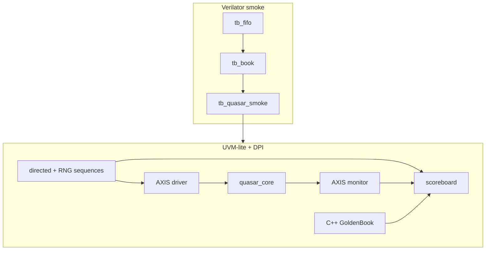

# Verification

Quasar is verified on three rungs.  The bottom two run under **Verilator
5.x** (`make`).  The top rung is written against UVM-lite classes that
map 1:1 onto a commercial UVM agent if you have Xcelium / VCS / Questa.



## How to run

Prerequisites: `verilator` ≥ 5.020, `g++` with C++17, `make`.

```bash
make fifo     # sync FIFO, skid, CRC-32, priority encoder
make book     # directed book command test (no SoC)
make smoke    # quasar_core, 256-bit AXIS, AXI-Lite, directed stream
make uvm      # UVM-lite + DPI golden scoreboard
make all      # fifo + book + smoke
make loc      # line counts
```

Waves: Verilator is invoked with `--trace --trace-structs`.  `*.vcd` /
`*.fst` land under `build/<target>/` depending on the harness.

Commercial sim (full UVM + covergroups):

```text
# example Xcelium
xrun -sv -timescale 1ns/1ps +define+QUASAR_SVA \
     -f scripts/filelist.f \
     tb/common/quasar_tb_pkg.sv \
     tb/uvm_lite/quasar_agent.sv \
     tb/uvm_lite/tb_uvm_lite.sv \
     model/golden_book.cpp model/quasar_dpi.cpp \
     -access +rwc
```

Wrap the driver/monitor classes in `uvm_driver` / `uvm_monitor` and keep
the same mailboxes.  Covergroups in `assert/quasar_cover.sv` compile
when `VERILATOR` is **not** defined.

## Testbench topology

| TB | DUT | Stimulus | Checker |
|----|-----|----------|---------|
| `tb_fifo` | infra | directed fill/drain | exact data + CRC nonzero + MSB encoder |
| `tb_book` | `quasar_book` | `book_req_t` tasks | BBO, time/price priority, cancel middle, hash collision, STP, multi-inst |
| `tb_quasar_smoke` | `quasar_core` | packed `msg_t` + CRC | fills/acks/rejects, AXI-Lite VERSION/SCRATCH |
| `tb_uvm_lite` | `quasar_core` | class sequences | C++ `GoldenBook` via DPI-C |

The smoke path talks to `quasar_core` (256-bit AXIS) so CDC/width
converters are not on the critical debug path.  `quasar_soc` is still
compiled as part of `RTL_DUT` in the smoke file list to keep the wrapper
honest; a 64-bit pin-level test can instantiate it the same way with
four-beat frames (see `docs/protocol.md`).

## Scoreboard contract

The C++ model (`model/golden_book.*`) implements the same normative
rules as `docs/protocol.md`:

* price-time priority, maker price
* GTC / IOC / FOK / post-only
* cancel / modify / replace
* STP modes
* book-full and duplicate oid

`dpi_book_apply` is called with every **non-corrupt** command the driver
sent.  The monitor's events are compared in order, **skipping `EV_BBO`**
(side-channel).  After each command `dpi_book_invariants()` walks every
level and checks:

* no zero-qty resting order
* no empty level retained
* oid index ↔ walk consistent
* inst/side/price agree

A SystemVerilog twin (`model/golden_book.svh`) exists for DPI-free
environments.

## SVA

Compiled with `+define+QUASAR_SVA` and `--assert`.

| Module | Properties |
|--------|------------|
| `quasar_axis_sva` | valid/data hold, no-X, cover beat/stall |
| `quasar_fifo_sva` | no overflow/underflow, count bounds, empty⇒0 |
| `quasar_book_sva` | used ≤ cap, req hold, legal reject codes, cover match/insert/cancel |
| `quasar_nolost_sva` | inflight command credit bounded (proxy for “no lost orders”) |
| interfaces | AXIS / AXI-Lite hold properties in `quasar_*_if.sv` |

“No lost orders” in the strong sense is the scoreboard: every accepted
`NEW` is either filled, rested (and later cancellable), or rejected with
a reason.  The SVA credit counter is the synthesizable approximation.

## Coverage goals

Covergroups (`assert/quasar_cover.sv`) — commercial sim:

| Group | Bins | Goal |
|-------|------|------|
| opcode | NEW/CXL/REPL/MOD/STATUS/MASS | 100% |
| TIF | GTC/IOC/FOK × NEW | 100% |
| reject | all 15 `REJ_*` | ≥ 12/15 in constrained-random |
| fill qty | 1 / 2–8 / 9–32 / 33+ | all |
| side | bid/ask | 100% |
| cross(op, tif) | | ≥ 80% |

Verilator smoke uses `cover property` equivalents of the same bins.

Directed smoke already hits: rest, partial fill, cancel residual,
modify, IOC take, replace (price change), CRC reject, bad instrument,
cancel-miss, post-only, FOK reject, AXI-Lite R/W.

`tb_book` additionally hits: time priority, price priority, cancel
middle of a 3-order queue, hash-bucket collision (`0x01` vs `0x0100`),
multi-instrument isolation, STP without consume.

## Constrained-random knobs

`quasar_txn` in `quasar_tb_pkg.sv`:

```systemverilog
constraint c_op   { opcode inside {NEW, CANCEL, REPLACE, MODIFY, STATUS}; }
constraint c_inst { inst inside {[0:NUM_INSTRUMENTS-1]}; }
constraint c_qty  { qty  inside {[1:64]}; }
constraint c_px   { price inside {[100:200]}; }
```

`quasar_seq_lib::random_stream(n)` tightens to `NEW` + GTC on four
names and a narrow price band so the book actually crosses.  Mix in
`directed_rest_and_hit` / `directed_cancel` at the start of every
seed.

## Known TB limitations

* Soft-reset during an in-flight match is not yet a directed test.
* Mass-cancel is implemented in RTL and golden but only lightly
  exercised.
* Dual-clock async FIFO is compiled and used in `quasar_soc`; the
  default smoke ties clocks (still a legal, if degenerate, CDC).
* Covergroup auto-bins need a commercial simulator.
