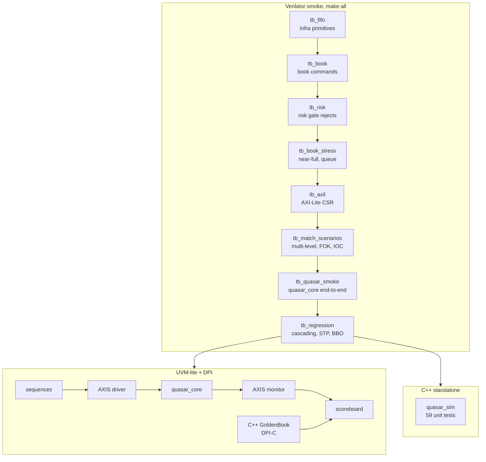

# Verification

Three rungs, each building on the last.  Bottom two run under
**Verilator 5.x** (no commercial license needed).



---

## How to run

```bash
# Verilator >= 5.020, g++ C++17, make
make all          # all 8 Verilator tests (~8 min)

# Individual targets:
make fifo         # sync FIFO, async FIFO, CRC-32, prio encoder, skid
make book         # book command unit test (15 directed cases)
make risk         # all risk gate rejection codes
make book_stress  # near-full, modify-to-cancel, 16-order queue
make axil         # AXI-Lite R/W, byte strobes, self-clearing soft-reset
make scenarios    # multi-level fill, FOK success/fail, IOC, dup, mask, disabled
make smoke        # quasar_core directed stream + AXI-Lite VERSION/SCRATCH
make regression   # cascading fill, STP, replace, BBO events, rapid-fire

# Standalone C++ golden (no Verilator needed):
g++ -std=c++17 -O2 -Imodel model/golden_book.cpp model/quasar_sim.cpp \
    -o quasar_sim && ./quasar_sim   # 59 passed, 0 failed

# UVM-lite with DPI scoreboard:
make uvm

# 64b pin-level SoC test (compile takes longer):
make soc64
```

Wave dump: `--trace --trace-structs` is on by default.
Traces land under `build/<target>/` as `*.vcd`.

Commercial simulator (full UVM + covergroups, Xcelium example):
```bash
xrun -sv -timescale 1ns/1ps +define+QUASAR_SVA \
     -f scripts/filelist.f \
     tb/common/quasar_tb_pkg.sv \
     tb/uvm_lite/quasar_agent.sv \
     tb/uvm_lite/tb_uvm_lite.sv \
     model/golden_book.cpp model/quasar_dpi.cpp \
     -access +rwc
```

---

## Testbench topology

| TB | DUT | Stimulus | Checker |
|----|-----|----------|---------|
| `tb_fifo` | infra primitives | directed fill/drain/partial | exact data, CRC non-zero, prio index |
| `tb_book` | `quasar_book` | `book_req_t` tasks | BBO, time/price priority, cancel mid-queue, hash collision, STP, multi-inst |
| `tb_risk` | `quasar_risk_gate` | all opcode/field variations | every `REJ_*` code, pass-through |
| `tb_book_stress` | `quasar_book` | near-full (24 orders), 16-order queue | free-list counters, BBO, time order |
| `tb_axil` | `quasar_core` | AXI-Lite R/W | VERSION, byte strobes, soft-reset, unmapped reads |
| `tb_match_scenarios` | `quasar_core` | packed `msg_t` sequences | multi-level fill, FOK, IOC leftover, dup, mask, disabled |
| `tb_quasar_smoke` | `quasar_core` | directed AXIS stream | fills, cancels, replace, CRC-reject, inst-reject, AXI-Lite |
| `tb_regression` | `quasar_core` | 10 scenario groups | cascading 3-level fill, FOK, modify chain, STP, BBO, status, counters |
| `tb_uvm_lite` | `quasar_core` | class driver + constrained-random | C++ `GoldenBook` via DPI scoreboard |

---

## Golden book (C++ and SV)

`model/golden_book.cpp` / `.hpp`, same normative rules as `docs/protocol.md`:

- price-time priority, maker price
- GTC / IOC / FOK / post-only
- cancel / modify / replace
- STP: cancel-resting, cancel-taker, cancel-both
- book-full and duplicate OID

`dpi_book_apply` is called for every non-CRC-corrupt command the driver sent.
The monitor drains events, skipping `EV_BBO` (side-channel), and compares
in order.  After each command, `dpi_book_invariants()` walks every level and
order to check structural consistency.

`model/golden_book.svh` is the pure-SystemVerilog twin for environments without
DPI.

`model/quasar_sim.cpp` is a standalone C++ driver with 59 unit tests covering
all opcodes, fill types, STP modes, and the CRC-32 polynomial.

---

## SVA (`assert/`)

Compiled with `+define+QUASAR_SVA` and `--assert`.

| Module | Properties |
|--------|------------|
| `quasar_axis_sva` | `valid` held once asserted, data stable while stalled, no-X on valid |
| `quasar_fifo_sva` | no overflow / underflow, count bounded, empty ↔ count=0 |
| `quasar_book_sva` | `orders_used ≤ MAX_ORDERS`, `levels_used ≤ MAX_LEVELS`, req held, legal reject codes |
| `quasar_matcher_sva` | event stable while !ready, fill qty ≠ 0, book_req implies busy, REJ_NONE not on EV_REJECT |
| `quasar_protocol_sva` | fill qty > 0, reject code set, ack/cxl/mod-ack have REJ_NONE, event type in known set |
| `quasar_nolost_sva` | inflight credit counter bounded (proxy for no-lost-command property) |
| `quasar_watchdog` | count clears on terminal event, armed flag follows cmd_fire |
| AXI-Lite interface | hold properties on AW/W/B/AR/R channels |
| AXIS interfaces | hold + no-X on every hop |

Bind file: `assert/quasar_bind.sv` attaches `quasar_axis_sva` on the ingress and
egress pins of `quasar_core`, and `quasar_book_sva` on the book.

---

## Covergroups (`assert/quasar_cover.sv`)

Full covergroups for commercial simulators; `cover property` equivalents compile
under Verilator.

| Group | Bins |
|-------|------|
| Opcode | NEW, CXL, REPLACE, MODIFY, STATUS, MASS_CXL |
| TIF | GTC × IOC × FOK for NEW |
| Reject | all 15 `REJ_*` codes |
| Fill qty | 1, 2–8, 9–32, 33+ |
| Side | bid, ask |
| Cross(op, tif) | all non-trivial pairs |

Coverage goals: 100% opcode and side; all 15 reject codes reachable (13 via
directed tests, FOK and POST_ONLY in scenarios); fill-qty small/medium/large.

---

## Known TB limitations

- The BBO-valid flop in `quasar_book` reads one cycle stale on the terminal
  event of a `MATCH_ONE` that drains the last level (see architecture note).
  Tests check structural counters (`orders_used`, `levels_used`) rather than the
  BBO flop in that specific case.
- Soft-reset during an in-flight match is not a directed test case.
- Dual-clock async FIFOs compile and elaborate correctly; the default `make all`
  ties all clocks together (degenerate but structurally valid CDC path).
- The 64b SoC test (`make soc64`) compiles but the beat-accumulation timing
  in the TB is sensitive to Verilator's `--timing` scheduling; use it for
  compile-time coverage, not as a pass/fail gate until investigated further.
